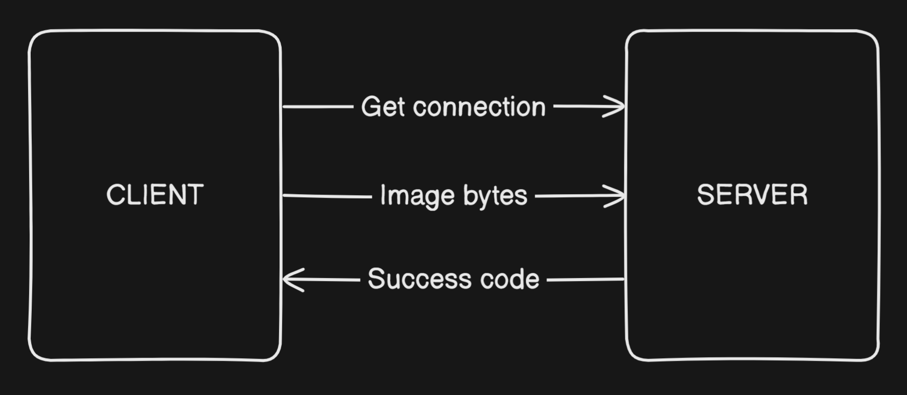

<h1>Module 2</h1>

use ***python 3.9***

```
pip install -r requirements.txt
```


<h2>How it works</h2>
1. Set connection by <b>web-socket</b> and set parameters <br>
2. Client send encoded frames to server until required emotion won`t detected <br>
3. Whet server detect required emotion, it send a success code to client <br>
<br>



<h2>Json schemas</h2>

Get connection

```json
{
  "emotion": "happy",
  "confidence": 0.5
}
```

Success code

```json
{
  "status": "detected",
  "emotion": "happy",
  "confidence": 0.67
}
```
